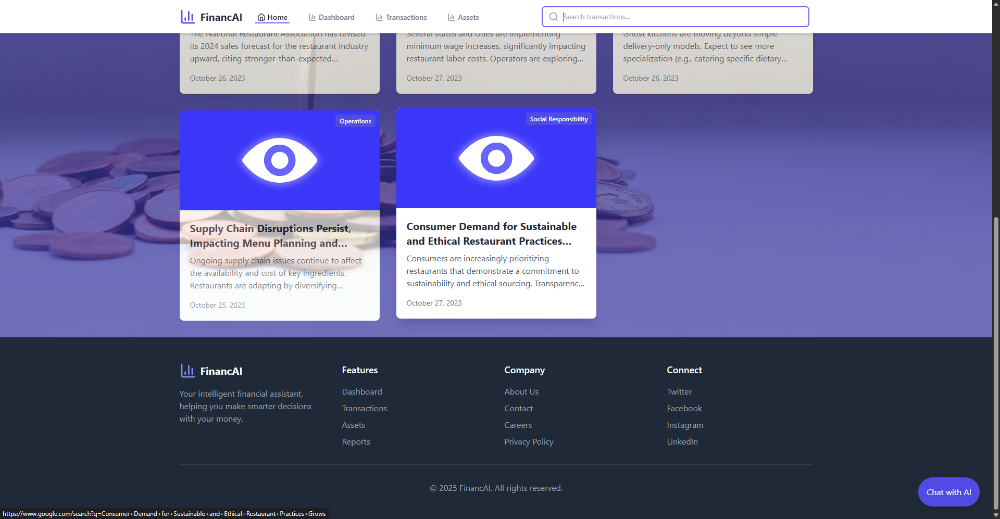
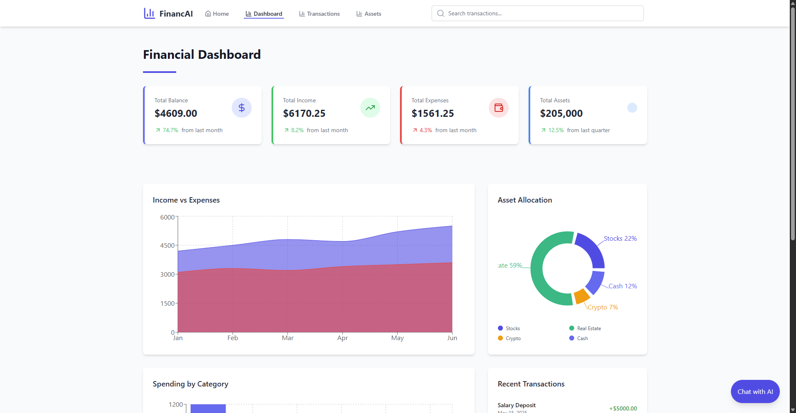
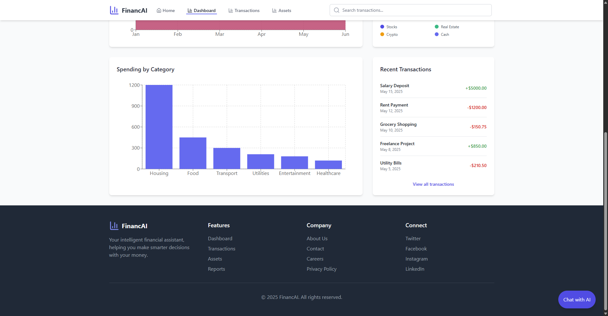
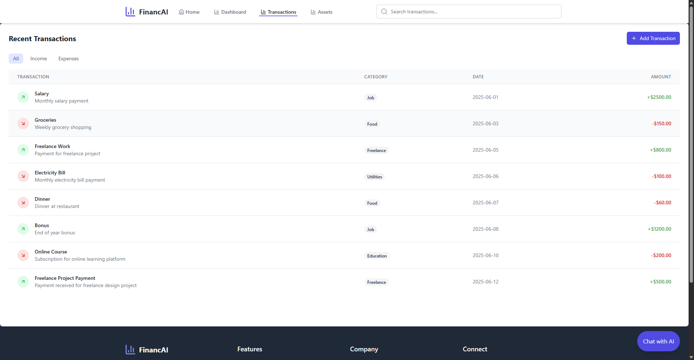
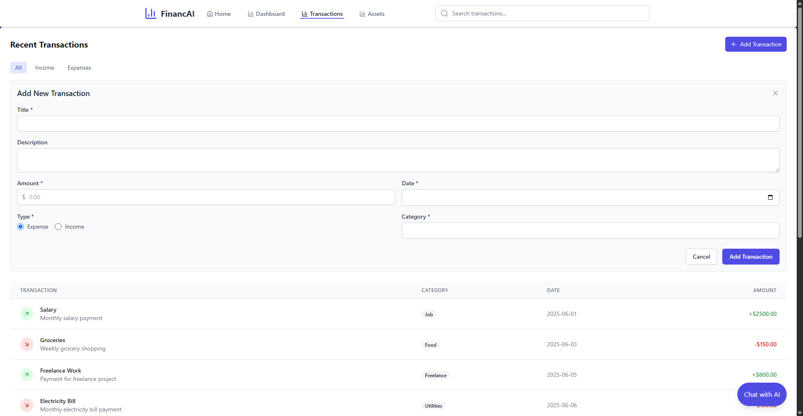
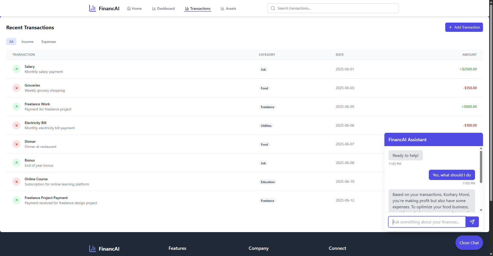

# FinancAI – AI-Powered Financial Banking System

A full-stack **Flask + React** project for Google's AI Finance Hackathon on **February 27, 2025**, designed to help users **track, analyze, and visualize their financial data** with AI-driven insights.

---

## 🔍 Overview

FinancAI is an intelligent financial banking system built for businesses and individuals to:
- Securely manage **transactions** and **expenses**
- Receive **automated financial summaries**
- Interact with a built-in **AI chatbot** (powered by Google’s Gemini API) for personalized financial advice
- Visualize trends and detect anomalies using **ML models**

---

## 🛠️ Tech Stack

- **Frontend:** React.js + TypeScript
- **Backend:** Flask (Python)
- **AI Integration:** LangChain + Gemini API
- **Database & Auth:** Firebase
- **Deployment:** Firebase Hosting

---

## 📸 Screenshots

---

## 🚀 Features

- 🔐 **User Authentication** with Firebase
- 📊 **Transaction Visualization** and Budgeting Tools
- 💬 **AI Chatbot** for real-time finance Q&A
- 📈 **Anomaly Detection** using ML techniques
- 🔎 Clean, responsive UI with intuitive dashboards

# Frontend (React)
cd frontend
npm install
npm run dev
